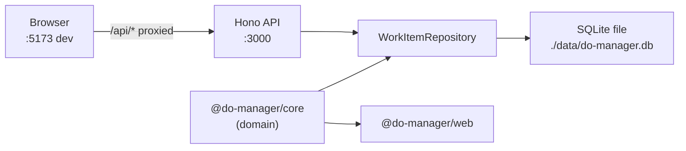
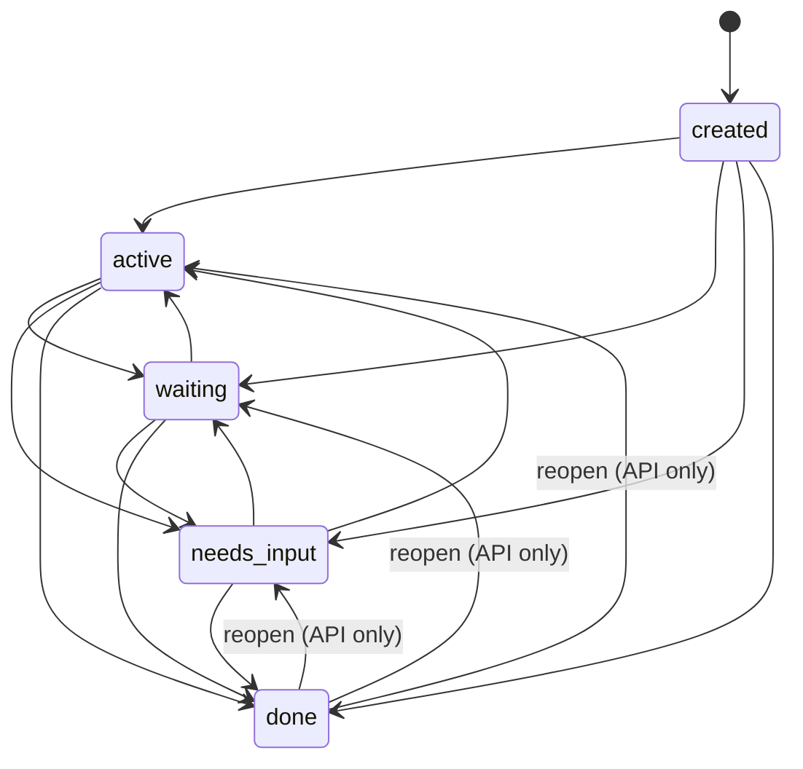
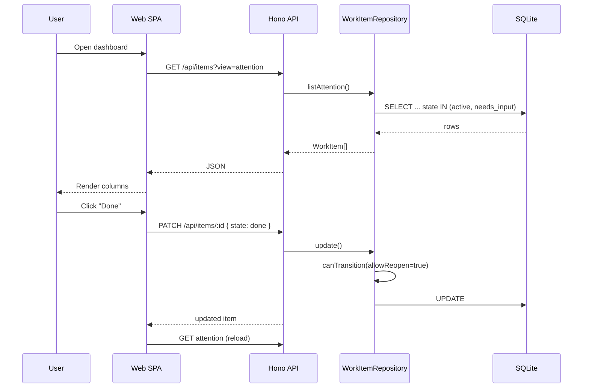

# do-manager — Development Specification (Reverse-Engineered)

| Field | Value |
| --- | --- |
| Document version | 1.0 |
| Repository snapshot | Initial bootstrap (`447eb89`) |
| Generated from | Source, tests, migrations, CI, README |
| Scope | As-implemented behavior only |

---

## 1. Executive Summary

**do-manager** is a local-first, single-user web application for tracking **work threads** (partially consumed attention contexts) rather than traditional tasks. The system persists cross-domain items (PRs, builds, Slack threads, agents, etc.) and surfaces only those in **attention-requiring states** (`active`, `needs_input`) in the primary UI.

**Current maturity:** early bootstrap (~860 lines TypeScript). Core domain model, REST API, SQLite persistence, and a minimal React dashboard exist. No authentication, no external integrations, no background jobs, and no production deployment artifacts are implemented.

**Confidence:** High — conclusion supported by `README.md`, `packages/core`, `apps/api`, `apps/web`, and tests.

---

## 2. System Overview

### 2.1 Purpose

The system helps a knowledge worker answer: *“What currently requires my attention?”* by:

1. Storing **work items** with lifecycle state and provenance (`source`).
2. Filtering the default view to **attention states** only.
3. Allowing manual capture and state transitions until an item is **done** (removed from attention view).

Product intent is documented in `README.md`. Implemented behavior matches that intent at a minimal level.

### 2.2 Runtime Topology

| Process | Entry point | Default port | Role |
| --- | --- | --- | --- |
| Web (dev) | `apps/web` via Vite | 5173 | SPA; proxies API |
| API | `apps/api/src/index.ts` | 3000 | REST + migrations on startup |
| Core | `packages/core` | N/A (library) | Shared types + state machine |

**Deployment model:** none defined. No Dockerfile, compose file, or hosting config exists. **Confidence:** High.

### 2.3 Repository Structure

| Path | Responsibility |
| --- | --- |
| `packages/core` | Domain types, attention constants, state transition rules |
| `apps/api` | HTTP API, validation, persistence, migrations |
| `apps/web` | Attention dashboard UI |
| `.github/workflows/ci.yml` | Quality + security audit gates |
| `docs/` | Engineering documentation (this file) |

Monorepo managed by **pnpm workspaces** (`pnpm-workspace.yaml`). Node **≥22** required (`package.json`).

---

## 3. Domain Model

### 3.1 Primary Entity: Work Item

A **work item** represents an unfinished thread of work requiring eventual user attention.

| Field | Type | Required | Semantics |
| --- | --- | --- | --- |
| `id` | UUID string | Yes | Server-generated on create (`randomUUID`) |
| `title` | string (1–500) | Yes | Human-readable label; trimmed on write |
| `state` | enum | Yes | Lifecycle state (see §3.2) |
| `source` | enum | Yes | Origin domain (see §3.3) |
| `link` | URL or null | No | Optional external resource |
| `lastTouched` | ISO 8601 string | Yes | Last interaction timestamp |
| `createdAt` | ISO 8601 string | Yes | Creation time |
| `updatedAt` | ISO 8601 string | Yes | Last mutation time |

**Evidence:** `packages/core/src/types.ts`, `apps/api/src/db/schema.ts`, `apps/api/drizzle/0000_init.sql`.

### 3.2 Lifecycle States

| State | In attention view? | Meaning (as implemented) |
| --- | --- | --- |
| `created` | No | Valid state in model/API; not used by web UI on create |
| `active` | Yes | User is actively engaged |
| `waiting` | No | Blocked on external/async work |
| `needs_input` | Yes | Requires user decision or response |
| `done` | No | Terminal; excluded from attention queries |

**Attention states** (canonical filter): `['active', 'needs_input']` — `ATTENTION_STATES` in `packages/core/src/types.ts`. **Confidence:** High (tested in `state-machine.test.ts` and `work-items.test.ts`).

### 3.3 Source Types

Enumerated provenance labels (metadata only; no integration behavior):

`email`, `slack`, `browser`, `pr`, `agent`, `build`, `meeting`, `manual`

**Evidence:** `WORK_ITEM_SOURCES` in `packages/core/src/types.ts`. **Confidence:** High.

Sources affect UI badge display only. No connector reads or writes based on source. **Confidence:** High.

### 3.4 State Machine

**Rules (`packages/core/src/state-machine.ts`):**

| Rule | Behavior | Enforcement |
| --- | --- | --- |
| Standard transitions | `ATTENTION_TRANSITIONS` map | API updates use `canTransition(..., allowReopen=true)` |
| No backward to `created` | Blocked from all non-created states | Repository throws; API returns **409** |
| Reopen from `done` | Allowed to `active`, `waiting`, `needs_input` | `ALL_TRANSITIONS` when `allowReopen=true` |
| Terminal without reopen | `done` has no outbound transitions in strict mode | `canTransition('done', *, false)` → false |

**Confidence:** High — covered by unit tests and repository integration test.

### 3.5 Domain Invariants

| Invariant | Enforced? | Notes |
| --- | --- | --- |
| Valid `state` values | Partially | Zod at API boundary; DB stores plain text |
| Valid `source` values | Partially | Zod at API; DB unconstrained |
| State transition legality | Yes | Repository before update |
| Title non-empty after trim | Yes | Create/update schemas + repository trim |
| `link` is valid URL when present | Yes | Zod `.url()` on API |
| Unique item identity | Yes | UUID primary key |
| Attention query correctness | Yes | SQL `IN` filter on `ATTENTION_STATES` |
| Automatic promotion waiting → needs_input | **No** | Not implemented |
| Dedup by `(source, link)` | **No** | Not implemented |

**Confidence:** High for enforced items; High for absent features (verified by code search).

### 3.6 Unused / Latent Domain API

| Export | Used by | Status |
| --- | --- | --- |
| `isWorkItemState`, `isWorkItemSource` | Nothing in apps | Exported; dead in runtime paths |
| `countByState` | Nothing | Repository method; unused |
| `created` state on create | API accepts; web always sends `active` | Partially latent |

**Confidence:** High.

---

## 4. Core Business Workflows

### 4.1 View Attention Queue

**Actor:** User (browser)

**Trigger:** Page load, Refresh button, after create/transition

**Steps:**

1. Web calls `GET /api/items?view=attention` (default query).
2. API returns items where `state ∈ {active, needs_input}`, ordered by `lastTouched` descending.
3. UI splits results into columns: **Needs input**, **Active**.

**Side effects:** None (read-only).

**Failure:** Generic error message if API unreachable (`apps/web/src/App.tsx`).

**Confidence:** High.

### 4.2 Capture Work Thread (Manual)

**Actor:** User

**Trigger:** Submit “Capture work thread” form

**Steps:**

1. User provides `title` and `source` (default `manual`).
2. Web POSTs `{ title, source, state: 'active' }` — no `link` field in UI.
3. API validates, assigns UUID, sets timestamps, persists.
4. UI reloads attention list.

**Default state:** `active` if omitted at API; web explicitly sets `active`.

**Side effects:** Insert row; updates `lastTouched`, `createdAt`, `updatedAt`.

**Confidence:** High.

### 4.3 Transition Item State

**Actor:** User

**Trigger:** Action buttons on item card

**UI-offered transitions:**

| Current state | Buttons |
| --- | --- |
| `active` | Waiting, Needs input, Done |
| `needs_input` | Resume (→ active), Waiting, Done |

**Steps:**

1. Web PATCHes `{ state: <target> }`.
2. Repository validates transition with reopen enabled.
3. On success: updates state, sets `lastTouched` and `updatedAt` to now.
4. Item disappears from attention view if moved to `waiting` or `done`.

**API error mapping:** invalid transition → **409** with message; not found → **404**.

**Confidence:** High.

### 4.4 List / Inspect / Delete (API-only from UI perspective)

| Workflow | API | Web UI |
| --- | --- | --- |
| List all items | `GET ?view=all` | Not exposed |
| Filter by single state | `GET ?state=<state>` | Not exposed |
| Get by ID | `GET /api/items/:id` | Not exposed |
| Delete item | `DELETE /api/items/:id` | Not exposed |
| Update title/link/source | `PATCH` fields | Not exposed |

**Confidence:** High.

### 4.5 Application Startup (API)

**Trigger:** `pnpm dev:api` or `pnpm start`

**Steps:**

1. Run Drizzle migrations against configured DB path.
2. Open SQLite via `@libsql/client` file URL.
3. Bind Hono server on `PORT` (default 3000).

Migrations run on **every** API start (`apps/api/src/index.ts`). **Confidence:** High.

---

## 5. Functional Behavior

### 5.1 API Contract

Base URL (dev): `http://localhost:3000`

| Method | Path | Query / Body | Success | Errors |
| --- | --- | --- | --- | --- |
| GET | `/health` | — | `{ status: "ok" }` | — |
| GET | `/api/items` | `view=attention\|all`, optional `state` | `{ items: WorkItem[] }` | 400 validation |
| GET | `/api/items/:id` | — | `{ item }` | 404 |
| POST | `/api/items` | create schema | `{ item }` 201 | 400 |
| PATCH | `/api/items/:id` | update schema (≥1 field) | `{ item }` | 400, 404, 409 |
| DELETE | `/api/items/:id` | — | 204 | 404 |

**Validation (`apps/api/src/routes/schemas.ts`):**

- Title: 1–500 chars, trimmed.
- Link: valid URL or null.
- PATCH requires at least one field.

**Confidence:** High.

### 5.2 Timestamp / “Touch” Semantics

On **create:** `lastTouched`, `createdAt`, `updatedAt` all set to same ISO timestamp.

On **update:**

- Default: `lastTouched` and `updatedAt` updated.
- If `touch: false` in PATCH body: `lastTouched` preserved; `updatedAt` still updated.

**Confidence:** High (`work-items.ts`).

### 5.3 Sort Order

All list endpoints sort by **`lastTouched` descending** (most recently touched first).

**Confidence:** High.

### 5.4 CORS

Single allowed origin from `CORS_ORIGIN` env (default `http://localhost:5173`). Applied globally via Hono middleware.

**Confidence:** High.

### 5.5 Error Handling

| Error type | HTTP | Response shape |
| --- | --- | --- |
| `HTTPException` | configured status | `{ error: message }` |
| Zod validation | 400 | `{ error, details }` |
| Unhandled | 500 | `{ error: "Internal server error" }` + `console.error` |

Web collapses failures to short user strings; does not surface API error details.

**Confidence:** High.

---

## 6. Architecture Overview

### 6.1 Style

**Modular monolith** split into:

- **Domain layer** (pure TS, no I/O)
- **Application/API layer** (HTTP + repository)
- **Presentation layer** (React SPA)

Dependency direction: `web → core`, `api → core`. Web does not import API code directly; communicates via HTTP.

**Confidence:** High.

### 6.2 Communication Flow

### 6.3 Transactional Boundaries

Each repository operation is a **single statement** (insert/update/delete/select). No explicit transactions spanning multiple operations. No optimistic locking or version columns.

**Concurrency assumption:** single-user local usage; last write wins. **Confidence:** High (inferred from design); **Medium** for multi-client conflict behavior (untested).

### 6.4 Coupling Risks

| Risk | Severity | Detail |
| --- | --- | --- |
| Enum drift DB ↔ core | Medium | DB stores unchecked text for `state`/`source` |
| UI transition map ≠ server rules | Medium | UI hardcodes allowed buttons; server is authoritative |
| Migrations on every boot | Low | Simplifies dev; redundant work at scale |
| Shared enum via Zod import from core | Low | Good coupling direction |

---

## 7. Module / Subdomain Breakdown

### 7.1 `@do-manager/core`

| Aspect | Detail |
| --- | --- |
| **Purpose** | Shared domain language |
| **Inputs/outputs** | Pure functions and types |
| **Dependencies** | None (runtime) |
| **Tests** | State machine unit tests |
| **Failure modes** | `transition()` throws on illegal move |

### 7.2 `@do-manager/api`

| Aspect | Detail |
| --- | --- |
| **Purpose** | Persist and expose work items |
| **Submodules** | `db/` (client, schema, migrate), `repository/`, `routes/` |
| **Dependencies** | Hono, Drizzle, libsql, Zod, core |
| **Tests** | Repository integration tests against temp SQLite files |
| **Failure modes** | DB file creation fails if path not writable; migration failure crashes startup |

### 7.3 `@do-manager/web`

| Aspect | Detail |
| --- | --- |
| **Purpose** | Attention-focused dashboard |
| **Dependencies** | React 19, Vite, core (types/constants only) |
| **Tests** | Minimal constant smoke test only |
| **Failure modes** | API down → load error message; no retry/backoff |

---

## 8. Data Model and Persistence

### 8.1 Storage

| Property | Value |
| --- | --- |
| Engine | SQLite (file-backed via `@libsql/client`) |
| Default path | `./data/do-manager.db` |
| Config | `DATABASE_URL` env |
| ORM | Drizzle |
| Migrations | `apps/api/drizzle/` (SQL + journal) |

**Schema (`work_items` table):**

| Column | SQL type | Notes |
| --- | --- | --- |
| `id` | TEXT PK | UUID |
| `title` | TEXT NOT NULL | |
| `state` | TEXT NOT NULL | No CHECK constraint |
| `source` | TEXT NOT NULL | No CHECK constraint |
| `link` | TEXT nullable | |
| `last_touched` | TEXT NOT NULL | ISO string |
| `created_at` | TEXT NOT NULL | ISO string |
| `updated_at` | TEXT NOT NULL | ISO string |

**Confidence:** High.

### 8.2 Data Ownership

Single implicit tenant: all rows belong to the local SQLite file. No user ID, workspace, or ACL columns.

**Confidence:** High.

### 8.3 Consistency Assumptions

- Immediate read-after-write on same API instance.
- No replication or sync.
- Git ignores `data/` and `*.db` (local state not versioned).

**Confidence:** High.

### 8.4 Backup / Retention

Not implemented. No purge/archival of `done` items.

**Confidence:** High.

---

## 9. Integration Points

| Integration | Status | Evidence |
| --- | --- | --- |
| GitHub / PRs | **Not implemented** | `source: pr` label only |
| Slack | **Not implemented** | Enum value only |
| Browser tabs | **Not implemented** | Enum value only |
| CI / builds | **Not implemented** | Enum value only |
| AI agents | **Not implemented** | Enum value only |
| Email | **Not implemented** | Enum value only |
| Webhooks / ingest API | **Not implemented** | Only generic CRUD |
| External auth (OAuth) | **Not implemented** | — |

**Dev proxy:** Vite forwards `/api` and `/health` to port 3000 (`apps/web/vite.config.ts`).

**Confidence:** High.

---

## 10. Security and Access Control

| Control | Implemented? | Detail |
| --- | --- | --- |
| Authentication | **No** | All endpoints public |
| Authorization | **No** | Anyone with network access can CRUD |
| Input validation | **Yes** | Zod on API inputs |
| SQL injection | **Mitigated** | Parameterized Drizzle queries |
| CORS | **Yes** | Single origin allowlist |
| HTTPS | **Not configured** | Local HTTP only |
| Secrets management | **N/A** | `.env.example` has no secrets |
| Rate limiting | **No** | — |
| Audit log | **No** | Only `updatedAt` on entity |

**Implied requirement (not met):** safe for localhost single-user only. Exposing API to a network without auth would allow full data control.

**CI security:** `pnpm audit --prod --audit-level=high` on push/PR to `main`.

**Confidence:** High.

---

## 11. Operational Characteristics

### 11.1 Configuration

| Variable | Default | Used by |
| --- | --- | --- |
| `PORT` | 3000 | API |
| `DATABASE_URL` | `./data/do-manager.db` | API |
| `CORS_ORIGIN` | `http://localhost:5173` | API |

Loaded from process environment; `.env` not auto-loaded by code (operator must export or use shell wrapper). **Confidence:** Medium — no `dotenv` dependency found.

### 11.2 Observability

| Capability | Status |
| --- | --- |
| Structured logging | No |
| Metrics | No |
| Tracing | No |
| Health check | `GET /health` only |
| Startup log | Console: port + migration side effect |

**Confidence:** High.

### 11.3 CI/CD

GitHub Actions workflow `CI`:

1. format check, lint, typecheck, test, build (Node 22)
2. production dependency audit (high severity)

Triggers: push/PR to `main`. No deploy job.

**Confidence:** High.

### 11.4 Local Development

`pnpm dev` runs API and web in parallel. Web production build is static assets (`apps/web/dist`); no static file serving integrated into API.

**Confidence:** High.

---

## 12. Non-Functional Requirements

| NFR | Explicit in code? | Likely implied | Current state |
| --- | --- | --- | --- |
| Performance | No | Low latency for personal scale | Unbenchmarked; fine for small datasets |
| Scalability | No | Single user | SQLite file bottleneck |
| Availability | No | Best-effort local | Single process, no HA |
| Resilience | No | Manual restart | No retries in web client |
| Privacy | No | Local data stays local | True if not deployed |
| Auditability | Partial | `lastTouched` / timestamps | No change history |
| Maintainability | Yes | TS strict, tests, CI | Good for size |
| Portability | Yes | Node 22+, pnpm | libsql avoids native better-sqlite3 |

---

## 13. Risks and Technical Debt

| ID | Risk | Impact | Evidence |
| --- | --- | --- | --- |
| R1 | No auth on API | High if networked | `apps/api/src/index.ts` |
| R2 | DB enums unconstrained | Medium | Migration SQL lacks CHECK |
| R3 | UI/server transition drift | Medium | Separate transition maps |
| R4 | `created` state orphaned in UX | Low | Web never creates/lists it |
| R5 | Dead code (`guards`, `countByState`) | Low | Unused exports |
| R6 | No integration idempotency | High for automation | No dedup keys |
| R7 | Production web serving undefined | Medium | Vite proxy dev-only |
| R8 | Error detail hidden in UI | Low | Poor debug UX |
| R9 | README CI badge placeholder `OWNER` | Low | `README.md` |
| R10 | No `dotenv` loading | Low | Manual env setup |

---

## 14. Known Unknowns and Validation Needed

### Q1: Is this intended to remain single-user local-only?

| | |
| --- | --- |
| **Why it matters** | Determines whether R1 (no auth) is acceptable |
| **Affects** | §10 Security, deployment model |
| **Missing evidence** | Product requirements doc, deployment plan |
| **Options** | (A) Local-only tool (B) Multi-device sync (C) Hosted multi-user |
| **Impact** | **High** |

### Q2: Should `waiting` items auto-promote to `needs_input`?

| | |
| --- | --- |
| **Why it matters** | Core product promise in original vision; not implemented |
| **Affects** | §4 workflows, future integrations |
| **Missing evidence** | Event sources, polling, webhooks |
| **Options** | Manual only vs automation rules vs external signals |
| **Impact** | **High** |

### Q3: Should items deduplicate by `(source, link)`?

| | |
| --- | --- |
| **Why it matters** | Integrations will create duplicates without upsert semantics |
| **Affects** | §8 data model, ingest API design |
| **Missing evidence** | Integration spec |
| **Impact** | **Medium** |

### Q4: How should production be deployed (web + API)?

| | |
| --- | --- |
| **Why it matters** | Vite proxy does not exist in production builds |
| **Affects** | §2 topology, §11 operations |
| **Missing evidence** | Dockerfile, reverse proxy config, `API_BASE` strategy |
| **Impact** | **Medium** |

### Q5: Is `created` a first-class state or legacy placeholder?

| | |
| --- | --- |
| **Why it matters** | Affects default create behavior and integrations |
| **Affects** | §3.2, §4.2 |
| **Missing evidence** | Intended ingest flow (`created` → auto-`active`?) |
| **Impact** | **Low** |

### Q6: Should `done` items be hidden permanently or archived/viewable?

| | |
| --- | --- |
| **Why it matters** | No UI for history/recall except API `view=all` |
| **Affects** | §4.1, §8.4 |
| **Impact** | **Medium** |

---

## 15. Appendix

### 15.1 Test Coverage Summary

| Area | Tests | Confidence in behavior |
| --- | --- | --- |
| State machine | 5 unit tests | High |
| Repository | 2 integration tests | Medium (happy path + one rejection) |
| Web | 1 smoke test | Low UI coverage |
| API routes | None direct | Inferred from repository + manual smoke |

### 15.2 Key File Index

| Concern | Primary files |
| --- | --- |
| Domain types | `packages/core/src/types.ts` |
| Transitions | `packages/core/src/state-machine.ts` |
| Persistence | `apps/api/src/repository/work-items.ts` |
| HTTP routes | `apps/api/src/routes/items.ts` |
| Validation | `apps/api/src/routes/schemas.ts` |
| UI behavior | `apps/web/src/App.tsx` |
| DB schema | `apps/api/drizzle/0000_init.sql` |
| CI | `.github/workflows/ci.yml` |

### 15.3 Terminology

| Term | Definition in this system |
| --- | --- |
| Work item | Persisted attention thread |
| Attention view | Items in `active` or `needs_input` |
| Source | Provenance label (not a live connector) |
| Touch | Update to `lastTouched` timestamp |
| Reopen | Transition from `done` back to active workflow |

---

## 16. Changelog / Revision History

| Version | Date | Author | Changes |
| --- | --- | --- | --- |
| 1.0 | 2026-06-05 | Reverse-engineered from repo | Initial specification from bootstrap commit `447eb89` |

---

*End of document.*
